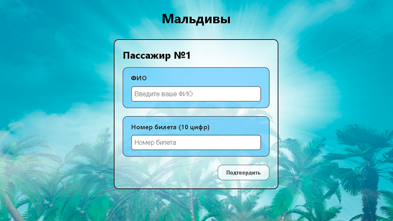
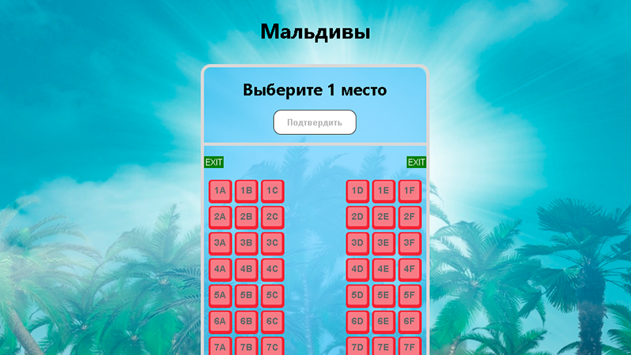
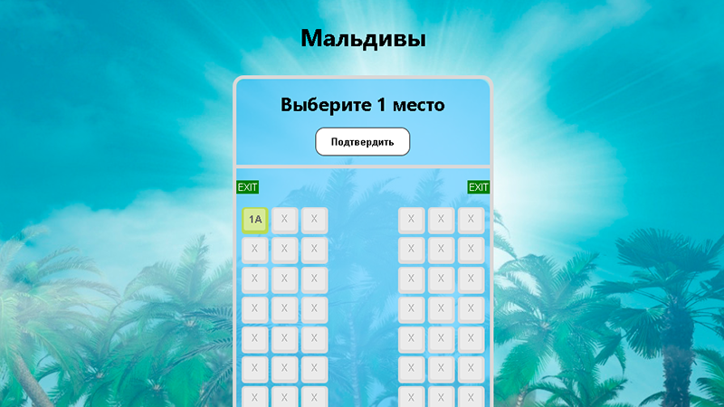
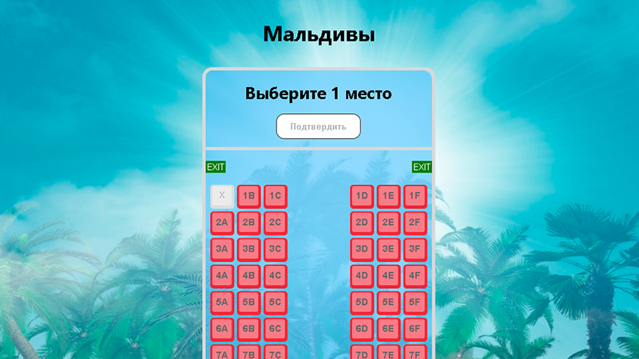

## Booking seats on the plane
Preview [Link](https://kirill8210.github.io/booking_seats/)
### Task description:
- Use JS modules for creating HTML
- Form for choosing a direction and entering the number of seats  

- Form for entering personal data  

- Scheme plane from API  

- Plane seat selection  

- Successful booking  

- Getting data from localStorage: visibility already closed seats for
   booking on plane scheme  
